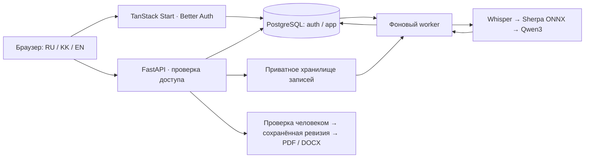

# Saint Tibo · Хаттама

**От записи совещания — к проверяемому протоколу и поручениям.**
Прототип команды Saint Tibo для BAITC Hacks: распознаёт речь, разделяет
голоса, готовит черновик саммари и поручений, связывает результат с записью
и экспортирует подтверждённую человеком редакцию в PDF/DOCX.

Секретарь получает основу протокола с источниками, а руководитель — список
обязательств и напоминания по срокам. Каждое спорное место можно проверить
прослушиванием; говорящий и ответственный по поручению учитываются отдельно.
Интерфейс доступен на русском, казахском и английском.

**[Открыть продукт](https://saint-tibo.win) · [Демо-доступ](DEMO.md) ·
[Требования кейса](docs/case.md) · [Статус выпуска](https://github.com/BAITC-Hacks/hack-a58598e0-saint-tibo/issues/94)**

## Проверить демо

| Окружение | Адрес | Назначение |
| --- | --- | --- |
| Production | [saint-tibo.win](https://saint-tibo.win) | Основной продукт для демонстрации |
| Dev Данила | [dev-danil.saint-tibo.win](https://dev-danil.saint-tibo.win) | Проверка интеграции и сохранённый пример |
| Личные dev | [Иван](https://dev-ivan.saint-tibo.win) · [Артём](https://dev-artem.saint-tibo.win) | Разработка коллег; версия может отличаться от production |

Откройте `/login` и войдите обычным демо-пользователем из [DEMO.md](DEMO.md).
Данные окружений независимы. Общий демо-аккаунт предназначен для разрешённых
образцов и синтетических данных; его содержимое доступно всем читателям репозитория.
На production нет автоматического dev-входа или переключателя в администратора.

Для короткого знакомства откройте
[сохранённую встречу на dev](https://dev-danil.saint-tibo.win/meetings/08e8afdd-1100-42c8-94dd-09db9a684dd4).
В ней есть настоящая запись, транскрипт и **явно обозначенный ручной протокол**.
Она демонстрирует прослушивание, правку и экспорт; автоматическое извлечение
проверяется отдельным проходом ниже.

### Сценарий с исходной записи

1. Создайте [совещание](https://saint-tibo.win/meetings/new): название,
   действительная дата, часовой пояс и известные участники. Перед записью
   уведомите участников об обработке. Для воспроизведения кейса скачайте
   [«Совещание №1»](input-audio/Совещание%20№1.mp3) или
   [«Совещание №2»](input-audio/Совещание%20№2.mp3) и загрузите файл в карточку.
2. В карточке `/meetings` выберите **«Транскрипт, говорящие и черновик протокола»**
   и запустите обработку. Есть также отдельные режимы транскрипта и транскрипта
   с говорящими. Дождитесь завершения фонового задания; страница показывает его состояние.
3. Прослушайте реплики по таймкодам. В блоке говорящих сопоставьте анонимные
   метки с участниками только после проверки. Назначение имени голосу
   не меняет исполнителей поручений автоматически.
4. Проверьте темы, решения, открытые вопросы, суть поручений, ответственных,
   исходную формулировку срока и ссылки на реплики. Неизвестные имя и дата
   остаются неизвестными. Особенно проверьте поздние уточнения и сроки
   «после события»: у модели здесь есть известные ошибки.
5. Сохраните правки, явно подтвердите протокол и скачайте **PDF и DOCX**.
   Экспорт использует сохранённую подтверждённую ревизию. Новая правка снимает
   подтверждение; конфликт двух редакторов требует явной загрузки серверной версии.
6. В [плеере](https://saint-tibo.win/player) доступны транскрипт, фильтр и
   последовательное прослушивание одного говорящего, сохранённый протокол и
   переход к полной проверке. Блок подробной работы объединяет загрузку,
   версии, ручную правку и экспорт; прежний `/workspace` перенаправляет сюда.
   Его кнопка «Получить транскрипт» запускает только транскрибацию — полный
   конвейер выбирается в карточке `/meetings`.
7. Откройте [напоминания](https://saint-tibo.win/notifications) и
   [брифинг](https://saint-tibo.win/briefing): они используют сохранённые
   поручения, статусы и даты. Брифинг собирается по выбранным участникам
   из последних 20 доступных встреч и содержит переходы к источникам.
   Задачи, календарь, аналитика, главная и предстоящее показывают сохранённые
   поручения и сроки; при отсутствии подходящих данных списки могут быть пустыми.
   Страница людей использует явно добавленных участников: имя в транскрипте
   само по себе не создаёт карточку человека.

### Подготовленные примеры Ивана для организаторов

В опубликованной [инструкции Ивана](https://github.com/BAITC-Hacks/hack-a58598e0-saint-tibo/commit/d193c01)
также зафиксированы две обработанные встречи на отдельном dev-ivan:

| Исходный файл | Готовая встреча на dev-ivan | Снимок результатов 23.09 |
| --- | --- | --- |
| [Совещание №1](input-audio/Совещание%20№1.mp3) | [Открыть встречу](https://dev-ivan.saint-tibo.win/meetings/666b27bb-fdde-4d4d-b7db-61836f2b5e77) | 76 реплик, 8 поручений |
| [Совещание №2](input-audio/Совещание%20№2.mp3) | [Открыть встречу](https://dev-ivan.saint-tibo.win/meetings/c8eb655d-7941-430d-a7d3-50229bdaa884) | 86 реплик, 5 поручений |

Они принадлежат общей учётке `dev-user@saint-tibo.local`. Если открыта другая
сессия, выйдите и откройте корень dev-ivan для обычного автоматического dev-входа;
режимы описаны в [руководстве](docs/browser-testing.md). В плеере выберите запись,
прослушайте источники и раскройте «Обработка и протокол встречи».
Эти данные не переносятся в production или новую локальную базу вместе с Git.
Настройки моделей и внешних адаптеров на dev-ivan могут отличаться от нашего
self-hosted production-профиля; эти примеры не доказывают его изоляцию.

Общие готовые встречи лучше просматривать без изменения. Для редактирования
и экспорта создайте свою встречу из того же MP3. Черновик может быть
неподтверждённым, поэтому PDF/DOCX до проверки заблокированы. В репозитории
есть исходные записи, а базу и результаты новое окружение формирует заново.
Текстовые образцы протоколов не являются дословной разметкой аудио.

## Покрытие кейса

Состояние реализации на **23 сентября 2026 года**. Точная версия на серверах
и подтверждения деплоя фиксируются в [задаче выпуска #94](https://github.com/BAITC-Hacks/hack-a58598e0-saint-tibo/issues/94).

| Требование | Реализовано | Граница готовности |
| --- | --- | --- |
| Запись и загрузка | Приватные файлы, встреча/участники, браузерный захват с разрешением пользователя | Автоматический вход бота в Teams, Zoom и Meet не завершён |
| RU / KK / смешанная речь | Self-hosted Whisper, выбор языка, реплики с таймкодами | На длинной казахской и смешанной речи остаются существенные ошибки |
| Диаризация | Анонимные интервалы голосов, прослушивание и ручное подтверждение участника | Метка голоса не доказывает личность; сложные записи требуют проверки |
| Поручения и саммари | Локальная LLM, структурированный черновик, исполнители, формулировки сроков, источники | Возможны пропуски поручений и поздних исправлений сроков |
| Проверка и протокол | Сохранённые ревизии, конфликт правок, подтверждение, PDF и DOCX с кириллицей | Автоматический черновик не считается утверждённым |
| Напоминания | Встроенный список по подтверждённым поручениям и их срокам | Внешние рассылки и интеграция с СЭД — дальнейшая работа |
| Обработка своими моделями | STT и извлечение на выделенной NVIDIA GPU, CPU-диаризация | GPU — отдельная управляемая нами облачная VM, не on-premise инфраструктура заказчика |

Основной демонстрационный конвейер не требует внешнего LLM API.
Необязательные API-извлечение и Honcho `/ask` **выключены в нашем production-выпуске**.
Внешний адрес в их конфигурации может передавать текст или контекст встречи
провайдеру и не соответствует закрытому профилю кейса. Их нельзя считать
готовой частью основного демо. Подробности: [API-адаптер](docs/api-extraction.md),
[Honcho](docs/honcho-ask.md).

Дополнительная поставка Артёма включает [лендинг](https://saint-tibo.win/landing)
и canvas встречи: цель, исходные данные, ожидаемые результаты, план и артефакты.
Canvas хранится версиями с привязкой к записи и результату обработки
([описание API](.serena/memories/API-60-meeting-canvas.md)). Это описание вошедшего
кода; оно не заменяет отдельную приёмку полного сценария canvas.
Режим демонстрационных fixtures отделён от реальных данных сессии; для
проверки модели используйте фактическую обработку исходной записи.

## Архитектура



- **Frontend:** React 19, TanStack Start/Router/Query, TypeScript 7,
  Tailwind CSS, shadcn/Base UI; TypeScript SDK генерируется из OpenAPI.
- **Backend:** FastAPI, Pydantic, SQLAlchemy/Alembic; PostgreSQL хранит
  встречи, задания, сегменты, результаты и ревизии. Better Auth/Drizzle
  обслуживают отдельную схему авторизации.
- **Обработка:** закреплённый Whisper large-v3-turbo через faster-whisper
  и CTranslate2; sherpa-onnx для голосов; Qwen3-8B Q4_K_M через llama.cpp b11120
  для черновика. Локальный CPU-профиль также поддерживается.
- **GPU-путь:** выделенная NVIDIA L4 24 ГБ, отдельные ограниченные SSH-команды
  для распознавания и извлечения, закреплённые ключи хоста и модели.
  Только необходимые данные задания передаются по SSH; GPU-процесс не получает
  доступ к базе приложения. GPU-ошибка не включает скрытый внешний fallback.
- **Хранение и доступ:** запись доступна через авторизованный медиапрокси;
  права проверяются по владельцу встречи. Исходный результат обработки
  отделён от ручных редакций. Экспорт формируется из конкретной ревизии.

Веса и runtime проверяются по закреплённым версиям и SHA-256.
Подготовка моделей выполняется отдельно; при обработке они не скачиваются.
Конфигурация и реальные ключи остаются вне Git. Общие демо-доступы публикуются
намеренно, а исходные MP3 кейса включены по разрешению владельца.

## Запуск из репозитория

Нужны Git, **Bun 1.4.2**, **uv 0.12.13+** и Docker с Compose.
Python **3.13** задаётся в `backend/.python-version` и устанавливается uv.
Для полного CPU-извлечения подготовленный runtime рассчитан на Linux x86_64;
worker ограничен 4 CPU и 8 ГиБ RAM, память для остальных сервисов нужна отдельно.
Состав пакетов фиксируют lock-файлы и [stack-pin](build/stack-pin.json).

```sh
git clone https://github.com/BAITC-Hacks/hack-a58598e0-saint-tibo.git
cd hack-a58598e0-saint-tibo
git switch main
bun run setup
```

`setup` устанавливает зависимости, создаёт `.env` со случайным секретом,
запускает PostgreSQL и применяет миграции. Повторный запуск сохраняет данные
и существующий секрет. Настройки перечислены в [.env.example](.env.example).

### Локальная обработка и Docker

Подготовьте модели до запуска. Следующие команды скачивают только
закреплённые публичные артефакты моделей, без передачи ваших записей:

```sh
uv run --python 3.13 python tools/transcribe/prepare_model.py ./models/small
uv run --python 3.13 python tools/diarize/prepare_models.py ./models/diarization-v1
bun run demo
```

Откройте [приложение](http://localhost:3000), зарегистрируйтесь и войдите.
[Swagger](http://localhost:8000/docs) и
[readiness](http://localhost:8000/health/ready) доступны локально.
Compose запускает frontend, API, миграции и **processing-worker**.
Этот минимальный вариант поддерживает транскрибацию и разделение голосов.

Для полного автоматического протокола дополнительно подготовьте
`models/llama-b11120` с закреплённым `llama-server` и библиотеками, а также
`models/qwen3-8b/Qwen3-8B-Q4_K_M.gguf`. Ревизии и контрольные суммы — в
[описании CPU bundle](docs/llm-feasibility.md#pinned-provisional-bundle)
и [проверках runtime](tools/extract/extract/runtime.py).
Пути задают `EXTRACT_RUNTIME_PATH` и `EXTRACT_MODELS_PATH` в `.env`.
Без этих файлов режим полного извлечения завершится явной ошибкой;
распознавание продолжит работать отдельно. `setup` веса LLM не устанавливает.

Для turbo подготовьте bundle командой
`uv run --python 3.13 python tools/transcribe/prepare_model.py ./models/turbo --model turbo`
и установите `BACKEND_STT_MODEL_PATH=/models/turbo` в `.env`.
После изменения моделей или окружения пересоздайте сервисы через `bun run demo`.
GPU требует отдельной настройки драйвера, runtime, ключей и Compose override:
[GPU STT](docs/remote-stt.md) · [GPU-извлечение](docs/remote-extract.md).
Готовый GPU-образ привязан к подготовленному серверу; одного флага в `.env`
на новой машине недостаточно.

### Разработка и остановка

`bun run dev` запускает API и frontend с перезагрузкой, базу и миграции;
**отдельный processing-worker и модели эта команда не запускает**.
Для обработки используйте Docker-сценарий выше. Backend вне Docker требует
`ffmpeg` и `ffprobe` в PATH. Не запускайте оба варианта на одинаковых портах.

| Команда из корня | Назначение |
| --- | --- |
| `bun run setup` | Зависимости, `.env`, PostgreSQL и миграции |
| `bun run dev` | API и frontend для разработки |
| `bun run demo` / `bun run demo:stop` | Собрать и запустить / остановить Docker-стек |
| `bun run build` | Сборка frontend и Python-пакета |
| `bun run migrate` | Миграции схем `auth` и `app` |
| `bun run api:generate` | OpenAPI и TypeScript-клиент |
| `bun run infra:stop` | Остановить локальную базу без удаления данных |
| `bun run seed` | Создать только локальные демонстрационные аккаунты |

Локальный seed: `user@saint-tibo.local` и `admin@saint-tibo.local`, пароль
`saint-tibo-dev` или значение `SEED_PASSWORD`. Он не является production-входом.
`demo:stop` сохраняет именованные volumes. Для параллельных копий задайте
свои `COMPOSE_PROJECT_NAME`, порты и имя базы.

Деплой выполняется явно по [инструкции сервера](docs/dev-server.md);
Git push сам по себе его не запускает. Сборка и фактический проход продукта
служат доказательством выпуска; наличие команд проверки в репозитории
не означает, что все тестовые наборы выполнены.

## Подтверждённые результаты и ограничения

На исходном **«Совещании №2» длительностью 206 секунд** полный конвейер
с GPU завершился за **152 секунды**: STT — 16,8 с, диаризация — 60,9 с,
извлечение — 75,5 с. Предыдущий проход с GPU-STT и CPU-извлечением занял
664 с. Это наблюдение одного файла: prompt и число поручений различались,
поэтому сравнение не доказывает равное качество или гарантированное ускорение.
[Подробности и итог качества](https://github.com/BAITC-Hacks/hack-a58598e0-saint-tibo/issues/69#issuecomment-5795081748).

Реальный production-проход подтвердил загрузку, обработку, сохранение,
права доступа и экспорт; отдельный браузерный проход — конфликт редакций,
подтверждение, источники, говорящих и плеер:
[production API](https://github.com/BAITC-Hacks/hack-a58598e0-saint-tibo/issues/113#issuecomment-5794927457),
[браузер и скачанные документы](https://github.com/BAITC-Hacks/hack-a58598e0-saint-tibo/issues/94#issuecomment-5794265640),
[интегрированный интерфейс](https://github.com/BAITC-Hacks/hack-a58598e0-saint-tibo/issues/94#issuecomment-5794894930).
Проверка работоспособности не равна оценке точности моделей.

Известные незакрытые ограничения:

- **Извлечение:** пропущены позднее исправление срока до десяти дней и
  событийный срок. Автоматический черновик нужно сверять с записью
  ([#69](https://github.com/BAITC-Hacks/hack-a58598e0-saint-tibo/issues/69)).
- **Казахская и смешанная речь:** длинные примеры выявили ошибки имён,
  отрицаний, сроков и пропуски поручений; в смешанном примере не извлечены
  пять ожидаемых задач ([#70](https://github.com/BAITC-Hacks/hack-a58598e0-saint-tibo/issues/70)).
  Русские материалы кейса не служат эталоном точности для других языков.
- **Интеграции и промышленный контур:** автоматическое участие ботов,
  корпоративное развёртывание, расширенные роли, политики хранения и
  внешние уведомления требуют дальнейшей работы. Прототип не заявляет
  завершённую сертификацию или готовность корпоративной эксплуатации.

Приоритет развития: точность поручений и языков → надёжность захвата и
подключения к встречам → развёртывание в контуре заказчика и интеграция с СЭД.

## Навигация по проекту

| Путь | Содержание |
| --- | --- |
| `frontend/` | Приложение, авторизация, локализация, UI и generated SDK |
| `backend/src/saint_tibo/` | API, домены, обработка, доступ и экспорт |
| `backend/migrations/` · `frontend/drizzle/auth/` | Миграции прикладных данных и авторизации |
| `tools/transcribe/` · `tools/diarize/` · `tools/extract/` | Изолированные инструменты моделей |
| `contracts/openapi.json` | Снимок контракта API |
| `input-audio/` | Два разрешённых исходных MP3 кейса |

[Кейс и оценивание](docs/case.md) · [Демо и вход](DEMO.md) ·
[Текущий статус](docs/current-state.md) · [Контракты](docs/meeting-contract.md) ·
[Хранение записей](docs/recording-storage.md) · [Обработка](docs/processing-jobs.md) ·
[Транскрипт](docs/transcription.md) · [Говорящие](docs/diarization.md) ·
[Ревизии и экспорт](docs/reviewed-results.md) · [Напоминания](docs/reminders.md) ·
[Разработка и ветки](docs/development.md).

Команда: **Saint Tibo — Данил, Иван, Артём**.
